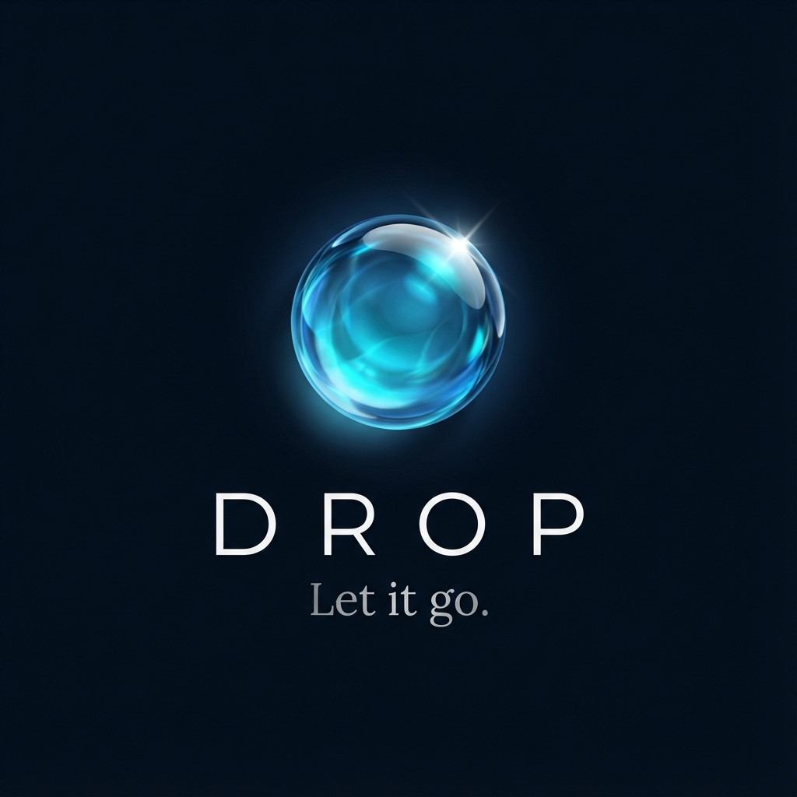
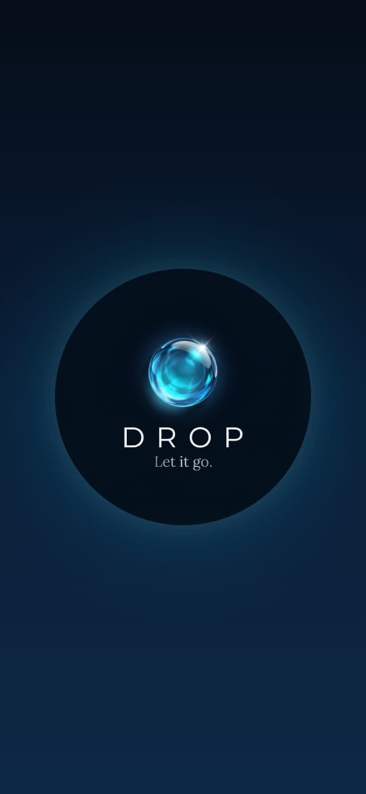
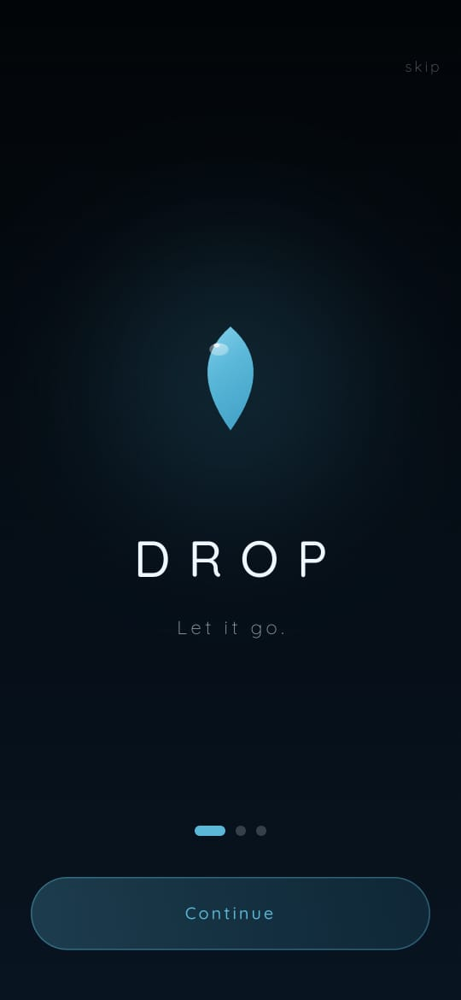
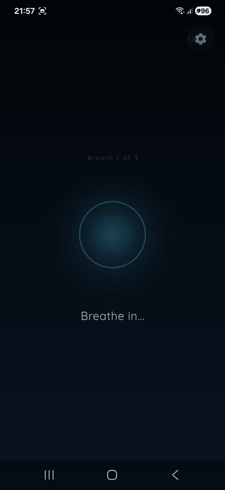
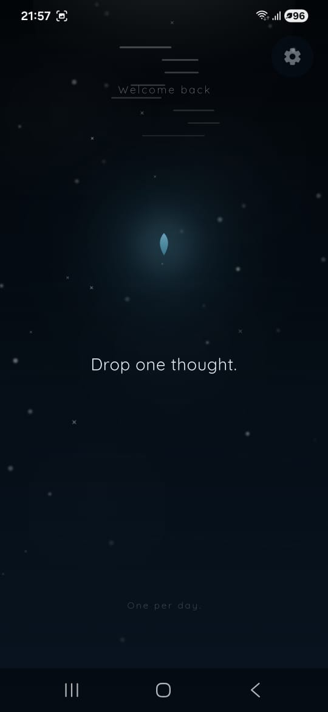
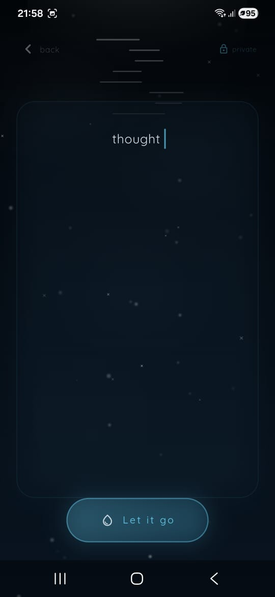
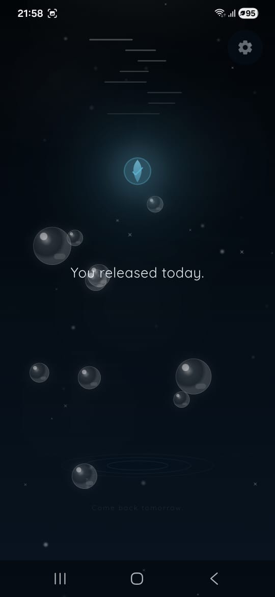

# 💧 DROP
### *Let it go. No judgment. No storage. Just release.*

<p align="center">
  
</p>

---

## 🕊️ What is DROP?
**DROP** is a minimalist mindfulness application designed for emotional release. It provides a safe, anonymous, and private sanctuary to type out your thoughts and watch them vanish into a serene digital lake. 

Built with **Flutter**, DROP focuses on the ritual of "letting go" without the pressure of social feeds, data tracking, or gamified stress.

---

## ✨ Features

### 🫧 The Release Ritual
- **Zero-Storage Privacy:** Your thoughts are visually transformed into droplets and destroyed immediately. Nothing is saved, anywhere.
- **Daily Mindful Drop:** Encouraging intentionality by limiting releases to one per day. No pressure, no backlogs.
- **Physics-Based ASMR:** Watch your thoughts morph into 3D water droplets, creating realistic ripples and trails as they fall.

### 🧘 Premium ASMR Interaction
- **3D Pop Therapy:** After your drop, interact with realistic 3D bubbles on the Home Screen.
- **Overlapping Soundscapes:** High-fidelity sound effects (`pop.mp3`, `relax.mp3`) that handle rapid interaction without delay.
- **Haptic Immersion:** Tactile feedback for every impact, pop, and release.

### 🕊️ Emotional Safety
- **Silence = Safety:** No "on fire" streak messages on the home screen.
- **Anonymous Journey:** No login, no accounts, no personalization. Just you and the lake.
- **Breathing Guide:** Integrated visual breathing tool to help regulate your state before and after release.

---

## 📱 Screenshots

<p align="center">
  
  
  
</p>

<p align="center">
  
  
  
</p>

---

## 🛠️ Tech Stack
- **Framework:** [Flutter](https://flutter.dev) (3.x)
- **State Management:** Provider / Service Pattern
- **Persistence:** Shared Preferences (for history/settings only)
- **Animations:** Custom Painters, Animation Controllers, Lottie
- **Audio:** Audioplayers (High-concurrency one-shots)
- **Haptics:** Vibration API

---

## 🚀 Getting Started

1. **Clone the repository:**
   ```bash
   git clone https://github.com/Maher-Tec/DROP.git
   ```
2. **Install dependencies:**
   ```bash
   flutter pub get
   ```
3. **Generate App Icons:**
   ```bash
   flutter pub run flutter_launcher_icons
   ```
4. **Run the app:**
   ```bash
   flutter run
   ```

---

## 🔒 Privacy & Safety
DROP is built on the promise of **complete anonymity**. We do not collect analytics, we do not store your typed text, and we do not use cloud databases. Your ritual stays on your device, and your thoughts vanish into the water.

---

<p align="center">
  Made with 💙 and 💧
</p>
